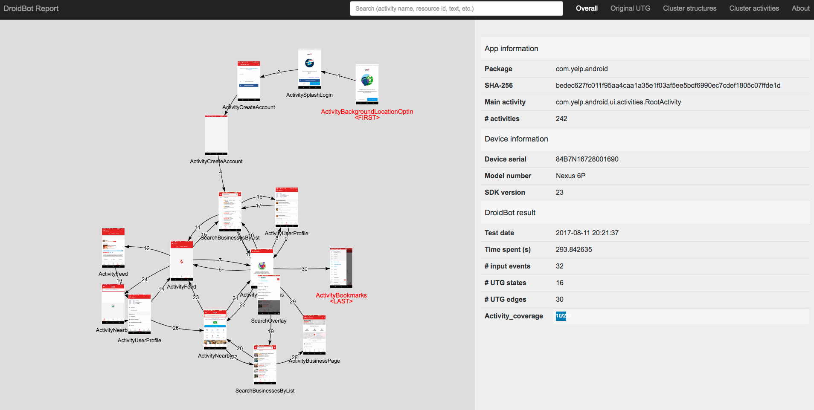

# DroidBot

## New!

We added a new policy named `memory_guided`, which uses machine learning to automatically identify similar views and avoid redundant explorations.
Please give it a try!

To use the `memory_guided` policy, you need [pytorch](https://pytorch.org/) and [transformers](https://huggingface.co/transformers/) installed. Use the command lines below:

```bash
pip install torch transformers
```

Then, start droidbot with the `-policy memory_guided``:

```bash
python start.py -a <xxx.apk> -o <output_dir> -policy memory_guided -grant_perm -random
```

## About
DroidBot is a lightweight test input generator for Android.
It can send random or scripted input events to an Android app, achieve higher test coverage more quickly, and generate a UI transition graph (UTG) after testing.

A sample UTG is shown [here](http://honeynet.github.io/droidbot/report_com.yelp.android/).

DroidBot has the following advantages as compared with other input generators:

1. It does not require system modification or app instrumentation;
2. Events are based on a GUI model (instead of random);
3. It is programmable (can customize input for certain UI);
4. It can produce UI structures and method traces for analysis.

**Reference**

[Li, Yuanchun, et al. "DroidBot: a lightweight UI-guided test input generator for Android." In Proceedings of the 39th International Conference on Software Engineering Companion (ICSE-C '17). Buenos Aires, Argentina, 2017.](http://dl.acm.org/citation.cfm?id=3098352)

## Prerequisite

1. `Python` (both 2 and 3 are supported)
2. `Java`
3. `Android SDK`
4. Add `platform_tools` directory in Android SDK to `PATH`
5. (Optional) `OpenCV-Python` if you want to run DroidBot in cv mode.

## How to install

Clone this repo and install with `pip`:

```shell
git clone https://github.com/honeynet/droidbot.git
cd droidbot/
pip install -e .
```

If successfully installed, you should be able to execute `droidbot -h`.

## How to use

1. Make sure you have:

    + `.apk` file path of the app you want to analyze.
    + A device or an emulator connected to your host machine via `adb`.

2. Start DroidBot:

    ```
    droidbot -a <path_to_apk> -o output_dir
    ```
    That's it! You will find much useful information, including the UTG, generated in the output dir.

    + If you are using multiple devices, you may need to use `-d <device_serial>` to specify the target device. The easiest way to determine a device's serial number is calling `adb devices`.
    + On some devices, you may need to manually turn on accessibility service for DroidBot (required by DroidBot to get current view hierarchy).
    + If you want to test a large scale of apps, you may want to add `-keep_env` option to avoid re-installing the test environment every time.
    + You can also use a json-format script to customize input for certain states. Here are some [script samples](script_samples/). Simply use `-script <path_to_script.json>` to use DroidBot with a script.
    + If your apps do not support getting views through Accessibility (e.g., most games based on Cocos2d, Unity3d), you may find `-cv` option helpful.
    + You can use `-humanoid` option to let DroidBot communicate with [Humanoid](https://github.com/yzygitzh/Humanoid) in order to generate human-like test inputs.
    + You may find other useful features in `droidbot -h`.

## Evaluation

We have conducted several experiments to evaluate DroidBot by testing apps with DroidBot and Monkey.
The results can be found at [DroidBot Posts](http://honeynet.github.io/droidbot/).
A sample evaluation report can be found [here](http://honeynet.github.io/droidbot/2015/07/30/Evaluation_Report_2015-07-30_1501.html).

## Acknowledgement

1. [AndroidViewClient](https://github.com/dtmilano/AndroidViewClient)
2. [Androguard](http://code.google.com/p/androguard/)
3. [The Honeynet project](https://www.honeynet.org/)
4. [Google Summer of Code](https://summerofcode.withgoogle.com/)

## Useful links

- [DroidBot Blog Posts](http://honeynet.github.io/droidbot/)
- [droidbotApp Source Code](https://github.com/ylimit/droidbotApp)
- [How to contact the author](http://ylimit.github.io)
